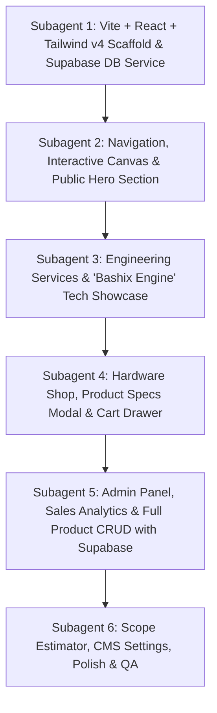

# Bashix Engineering Landing Page & Hardware Platform: PRD & Master Plan

---

## 1. Executive Summary & Brand Positioning

- **Name:** Bashix (`bashix.id`)
- **Tagline:** *"Hard Engineering. Scaled to Perfection."*
- **Brand Archetype:** High-performance systems engineering, deep-tech authority, precision hardware & software solutions.
- **Mission:** Engineering mission-critical distributed architectures, industrial IoT telemetry, edge AI acceleration, and manufacturing high-reliability physical engineering hardware for technology leaders.
- **Business Model:** Hybrid High-Tech Engineering:
  1. **Engineering Services & Enterprise R&D:** Custom distributed cloud systems, edge computing, embedded firmware, SRE.
  2. **Physical Engineering Products:** Turnkey industrial IoT gateways, neural inference accelerators, sensor nodes, and developer breakout kits.
  3. **Target Audience:** CTOs, hardware engineers, IoT architects, industrial automation directors, and technical founders.

---

## 2. Product Requirements Document (PRD)

### 2.1 System Architecture

```mermaid
graph TD
    Client[Visitor / Customer] --> Landing[Public Landing Page]
    Client --> Shop[Hardware Store & Cart]
    Client --> Form[Inquiry & Scope Estimator]
    
    AdminUser[Bashix Admin] --> AdminAuth[Supabase Auth (Admin Login)]
    AdminAuth --> AdminPanel[Admin Dashboard]
    
    Landing --> DB[(Supabase PostgreSQL)]
    Shop --> DB
    Form --> DB
    AdminPanel --> DB
    
    subgraph Supabase Cloud Backend
        DB --> ProductsTable[(products)]
        DB --> OrdersTable[(orders & order_items)]
        DB --> LeadsTable[(leads & inquiries)]
        DB --> SettingsTable[(site_settings)]
        Storage[(Supabase Storage: Product Images & Datasheets)]
    end
```

### 2.2 Feature Specifications

#### A. Public Landing Page Experience
1. **Dynamic Navigation Bar:**
   - Glassmorphic floating nav with specular border highlight (`backdrop-blur-md bg-opacity-80 border-white/10`).
   - Navigation links: *Services*, *Hardware Products*, *Architecture*, *Case Studies*, *Estimator*.
   - Cart quick-trigger with real-time counter badge.
   - Discreet portal trigger to Admin Dashboard.
2. **Immersive Hero Section:**
   - Announcement pill (`[ Hardware v2.4 // EdgeCore Modular Gateway Live ]`).
   - Dynamic Canvas Background: Interactive particle constellation reacting to cursor physics.
   - Dual Call-to-Action: "Order Hardware" (anchors to Shop) & "Consult Engineering Team" (opens Inquiry).
3. **Trust & Real-Time Performance Bar:**
   - Animated counter stats (99.999% SLA, <5ms P99 Latency, 12,000+ Hardware Units Deployed, 10M+ Daily Telemetry Packets).
   - Partner/client enterprise badges with subtle hover glow.
4. **Engineering Services & Capabilities (4 Verticals):**
   - *Distributed Systems & Cloud Fabrics*
   - *AI Platform & Inference Engineering*
   - *Embedded Systems & IoT Hardware Engineering*
   - *DevSecOps & SRE Hardening*
5. **"The Bashix Engine" Interactive Tech Showcase:**
   - Tabbed simulated architecture visualizer (`Distributed Mesh`, `Neural Inference`, `Edge Gateway`).
   - Monospace telemetry stream with live mock metrics (throughput, CPU latency, ping).
6. **Hardware Engineering Storefront (Physical Products Section):**
   - Grid of physical hardware units dynamically loaded from Supabase PostgreSQL.
   - Each product card includes: Product image, model tag (e.g. `BX-CORE-90`), pricing in IDR and USD, inventory status badge (`In Stock`, `Low Stock`, `Pre-Order`), key tech specs chips, and "Add to Cart" / "View Specs" buttons.
   - Interactive Product Quick-View / Technical Specs Modal with datasheets and pinout diagrams.
   - Slide-over Cart Drawer with quantity adjustment, dual-currency calculation, and one-click checkout.
7. **Process Methodology & Case Studies:**
   - 4-stage engineering lifecycle (Discovery -> Prototyping -> Stress Validation -> Production Rollout).
   - Real-world case study cards with measurable metrics.
8. **Interactive Project Scope Estimator & Consultation Modal:**
   - Interactive sliders/toggles for project scale, domain, and delivery timeline.
   - Validated consultation booking form syncing submissions directly to the `leads` table.
9. **Footer:**
   - Operational status beacon (`All Systems Operational`), tech stack tags, legal, and direct links.

---

#### B. Admin Management Portal & Sales Dashboard
A full-featured, secure admin dashboard allowing management of products, sales monitoring, and landing page content:

1. **Dashboard Overview & Sales Analytics:**
   - **KPI Cards:** Gross Revenue, Hardware Units Sold, Pending Inquiries, Low Stock Alert Count.
   - **Sales Trend Chart:** Interactive visual chart (weekly/monthly revenue and units shipped).
   - **Recent Activity Feed:** Latest orders, product updates, and consultation leads.
2. **Product Management (Full CRUD):**
   - **Read / List:** Table view with search, category filtering, and stock status indicators.
   - **Create:** Modal form to add new hardware products (Name, SKU, Category, Price IDR/USD, Stock count, Image URL / File Upload, Specification bullets, "Show on Landing Page" toggle).
   - **Update:** Live inline or modal edit of prices, stock, specs, and featured status.
   - **Delete / Archive:** Safe deletion with confirmation prompt.
   - **Landing Page Visibility Toggle:** Instantly toggle which items appear in the featured showcase on the landing page.
3. **Landing Page CMS / Settings:**
   - Update Hero Headline, Subtitle, and Announcement Badge text.
   - Update Company Contact Information, Email, and WhatsApp hotline.
   - System toggle between default Currency formats (`IDR` vs `USD`).
4. **Order & Lead Pipeline:**
   - View orders submitted from the cart with status updating (`Received`, `Processing`, `Dispatched`, `Completed`).
   - View consultation form submissions with direct contact action.

---

## 3. Database Architecture: Supabase (PostgreSQL)

### 3.1 Relational Database Schema (`schema.sql`)

- **`products`**: ID, SKU, Name, Tagline, Description, Category, Price IDR/USD, Stock Qty, Image URL, Specs (JSONB), Datasheet URL, `is_featured`, `is_active`, timestamps.
- **`orders`**: ID, Order Number, Customer Name, Email, Phone, Shipping Address, Total Amount, Currency, Status (`Pending`, `Processing`, `Dispatched`, `Completed`), timestamps.
- **`order_items`**: ID, Order ID, Product ID, Quantity, Unit Price, Subtotal.
- **`leads`**: ID, Name, Email, Company, Domain, Estimated Scale, Message, Status (`New`, `Contacted`), timestamps.
- **`site_settings`**: Key-value JSONB store for live hero copy, announcements, and contact information.

### 3.2 Dual-Tier Resilience & Local Development Mode
- **`src/services/db.js`**: An abstraction layer that checks if Supabase credentials (`VITE_SUPABASE_URL` and `VITE_SUPABASE_ANON_KEY`) are configured in `.env`.
- **Live Mode:** Connects to Supabase PostgreSQL with real-time WebSocket listeners.
- **Offline / Local Dev Fallback:** Seamlessly operates using local in-browser persistent state initialized with seed hardware data, ensuring immediate testing without blocking on external setup.

---

## 4. Technical Stack & Tailwind CSS v4 Configuration

- **Frontend:** React 18+ (JavaScript / JSX).
- **Tooling:** Vite (`npm run dev` with HMR).
- **Styling:** **Tailwind CSS v4** via `@tailwindcss/vite` with native CSS `@theme` tokens.
- **Database & Auth:** Supabase (PostgreSQL) + `@supabase/supabase-js`.
- **Icons:** Lightweight inline SVGs for zero bundle overhead and crisp rendering.

### 4.1 Tailwind CSS v4 `@theme` Specification (`src/index.css`)
```css
@import "tailwindcss";

@theme {
  /* Surfaces & Backgrounds */
  --color-bg-main: #07090E;
  --color-bg-card: #0D111A;
  --color-bg-card-hover: #131926;
  --color-bg-admin: #090C12;
  --color-border-subtle: rgba(255, 255, 255, 0.08);
  --color-border-glow: rgba(0, 240, 255, 0.35);

  /* Kinetic Brand Accents */
  --color-accent-cyan: #00F0FF;
  --color-accent-violet: #8A2BE2;
  --color-accent-emerald: #10B981;
  --color-accent-amber: #F59E0B;
  --color-accent-rose: #F43F5E;

  /* Typography */
  --font-heading: 'Space Grotesk', sans-serif;
  --font-sans: 'Inter', sans-serif;
  --font-mono: 'JetBrains Mono', monospace;
}
```

### 4.2 Workspace Layout
```text
├── index.html                   # HTML entry point, Google Fonts, meta tags
├── package.json                 # React, Vite, Tailwind CSS v4, Supabase JS
├── vite.config.js               # Vite config with @tailwindcss/vite plugin
├── PRD.md                       # Master Requirements & Database Architecture
├── .env.example                 # Supabase environment variables template
├── supabase/
│   └── schema.sql               # Ready-to-execute PostgreSQL migration script
├── public/
│   ├── favicon.svg              # Brand icon
│   └── products/                # Hardware product imagery
└── src/
    ├── main.jsx                 # React root mount
    ├── App.jsx                  # Main application orchestrator & view router
    ├── index.css                # Tailwind CSS v4 @import & @theme tokens
    ├── services/
    │   ├── supabase.js          # Supabase client initialization & auth helpers
    │   └── db.js                # Unified database service (Supabase + Local fallback)
    ├── context/
    │   └── StoreContext.jsx     # Centralized state (Products, Cart, Orders, CMS)
    ├── data/
    │   ├── initialProducts.js   # Seed hardware products
    │   └── initialConfig.js     # Seed site settings (Hero text, contact info)
    └── components/
        ├── common/              # Navbar, Footer, CanvasBg, Modal
        ├── landing/             # Hero, MetricsBar, Services, TechShowcase, Process, CaseStudies, Estimator
        ├── shop/                # ProductCard, ProductModal, CartDrawer
        └── admin/               # AdminNav, AnalyticsView, ProductManager, ProductFormModal, SiteSettings
```

---

## 5. Seed Hardware Products Catalog (Default Inventory)

1. **Bashix EdgeCore v2 (`BX-GW-02`)**: Industrial IoT Gateway. Quad RISC-V 1.8GHz, dual GbE, isolated RS485, eBPF telemetry. Rp 4,850,000 / $310. (42 in stock)
2. **Bashix NeuralNode 400 (`BX-AI-40`)**: Edge AI Accelerator. 32 TOPS INT8 NPU, 16GB LPDDR5, dual MIPI-CSI, passive cooling. Rp 12,500,000 / $799. (18 in stock)
3. **Bashix SensorGrid Pro (`BX-SN-01`)**: Tri-axis vibration, temperature/humidity, LoRaWAN + WiFi 6, IP67. Rp 1,950,000 / $125. (85 in stock)
4. **Bashix CAN-FD PCIe Bridge (`BX-BR-08`)**: Dual CAN-FD + LIN bus, hardware timestamping, sub-microsecond jitter. Rp 3,200,000 / $205. (24 in stock)

---

## 6. Sub-Agent Modular Execution Roadmap



1. **Subagent 1:** Vite + React setup with Tailwind CSS v4 (`@tailwindcss/vite`), `@theme` token definitions, `supabase/schema.sql`, and `src/services/db.js` (Supabase + local dev fallback).
2. **Subagent 2:** Sticky glassmorphic navbar (with cart counter & admin toggle), interactive particle canvas, hero section, and animated metrics bar using Tailwind v4 utility classes.
3. **Subagent 3:** 4 engineering service pillars and "The Bashix Engine" architecture viewer with live mock telemetry stream.
4. **Subagent 4:** Hardware product catalog grid connected to database, detailed technical specs/datasheet modal, and slide-in cart drawer with checkout.
5. **Subagent 5:** Full Admin Management Portal (sales analytics charts, product table with create/edit/delete/visibility toggles, order pipeline).
6. **Subagent 6:** Live CMS settings editor (hero text & contact info), project scope estimator, responsive audit (mobile to 4K), and QA.
